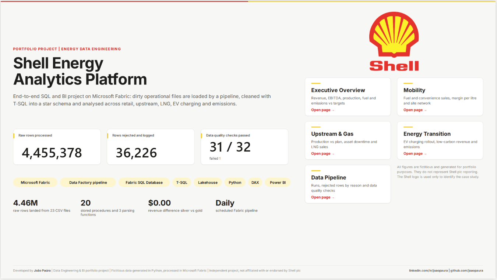
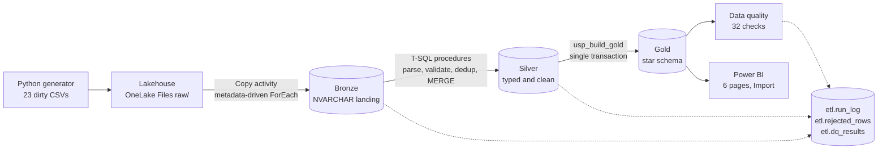
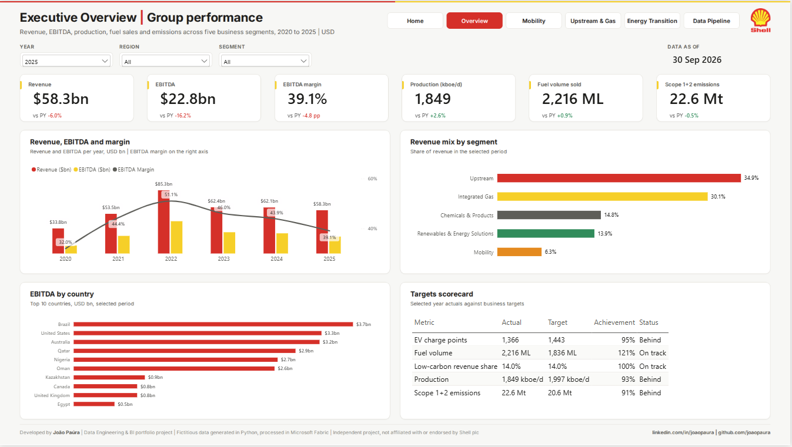
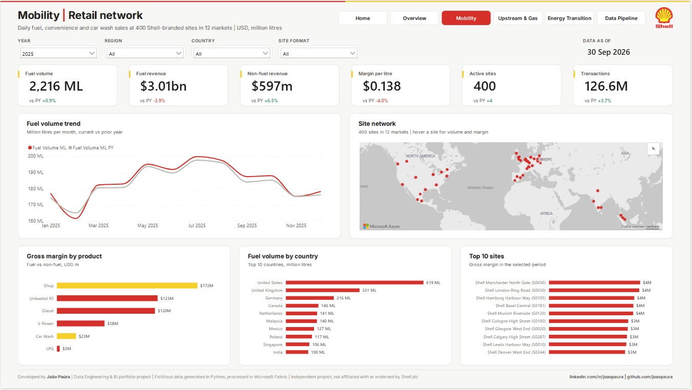
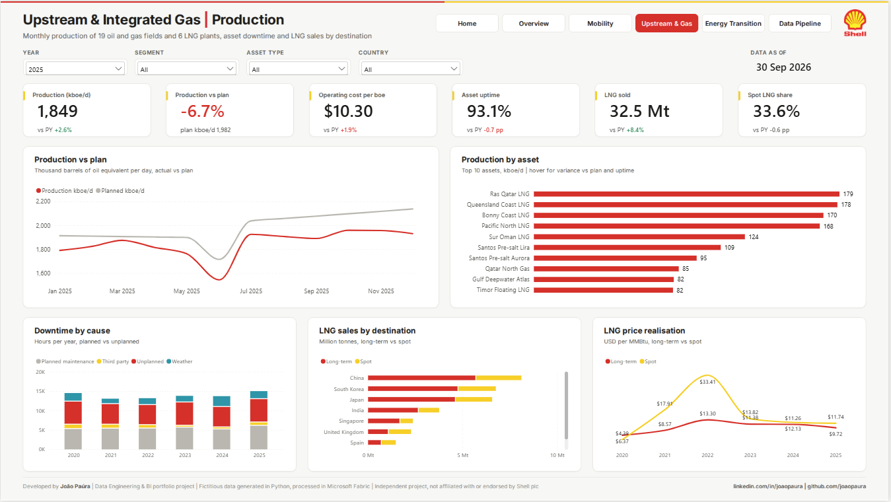
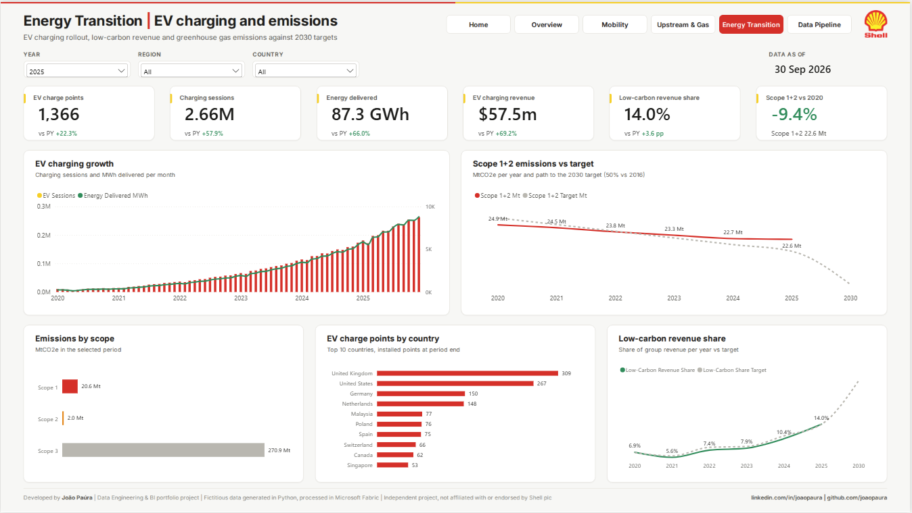
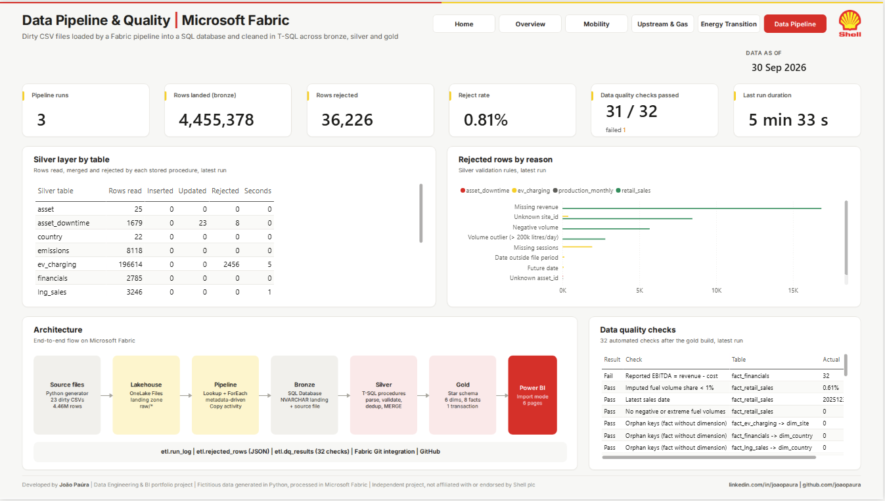

# Shell | Energy Analytics Platform on Microsoft Fabric

> End-to-end SQL and BI portfolio project on **Microsoft Fabric**. 23 intentionally dirty CSV files (4.46M rows) are loaded by a metadata-driven Fabric pipeline into a **Fabric SQL Database**, cleaned with hand-written **T-SQL** across bronze, silver and gold layers, checked by 32 automated data quality rules and analysed in a 6-page executive **Power BI** report covering retail, upstream, LNG, EV charging and emissions.

**[Open the live dashboard (Power BI)](https://app.powerbi.com/view?r=eyJrIjoiNmZiODEyOGUtZTU1Ny00Yjg3LTgzYmYtYmIxODJkMmFkNTM1IiwidCI6ImRlODdjNWRjLTBhMzctNDVlMi1hNzhhLTM3NDg0ODE0MDNiZiJ9)**

> **Disclaimer:** independent portfolio project, not affiliated with or endorsed by Shell plc. All figures are fictitious and generated in Python for portfolio purposes. The Shell logo is used only to identify the case study.



---

## At a glance

| | |
|---|---|
| **Data volume** | 23 CSV files, 4.46M raw rows (2020 to 2025): daily sales for 400 retail sites in 12 markets, EV charging, monthly production of 25 assets, LNG sales, P&L, emissions |
| **Dirty data** | 10 types of issues injected on purpose: duplicates, late corrections, 3 date formats, 74 country spellings, comma decimals and `$` prefixes, blanks, negative and x1000 values, orphan keys, future dates, swapped timestamps |
| **SQL** | 14 scripts: 4 schemas, 13 bronze + 13 silver + 14 gold tables, 20 stored procedures, 3 inline table-valued parsing functions, 6 views |
| **Cleaning result** | 36,226 rows rejected with reason and original row as JSON (0.81%), duplicates and late corrections resolved with `ROW_NUMBER()`, missing fuel volumes imputed |
| **Data quality** | 32 checks after every gold build: row counts, revenue reconciliation (0.00 USD difference silver vs gold), orphan keys, business rules, freshness, reject rate |
| **Orchestration** | Fabric Data Factory pipeline: Lookup + ForEach (4 in parallel) + Copy + stored procedures, full run in about 5 minutes |
| **Semantic model** | Star schema, 21 relationships (one inactive, activated with `USERELATIONSHIP`), 135 DAX measures with descriptions and display folders |

## Stack

`Microsoft Fabric` `Fabric SQL Database` `T-SQL` `Data Factory pipeline` `OneLake / Lakehouse` `Python` `Power BI` `DAX` `TMDL` `PBIR`

## Architecture



All layers live in **one Fabric SQL Database** (`sqldb_shell`) with four schemas: `bronze`, `silver`, `gold` and `etl`.

## Pipeline `pl_shell_daily`

```
LKP_Sources (etl.source_config)
  -> FE_LoadBronze (ForEach, batch 4)
       SP_PrepareBronze (safe TRUNCATE) -> CP_CsvToBronze (wildcard CSV -> bronze, $$FILEPATH as source_file) -> SP_LogCopy
  -> SP_Silver (etl.usp_silver_all) -> SP_Gold (etl.usp_build_gold) -> SP_DQ (etl.usp_run_dq_checks)
```

Adding a new source means adding one row to `etl.source_config`, not changing the pipeline.

## SQL highlights

| Script | What it shows |
|---|---|
| `03_value_map.sql` | One mapping table for 123 messy spellings (country, product, cause, contract type, scope, flags), matched with `TRIM` and a case-insensitive collation |
| `05_dim_date.sql` | Date dimension 2020 to 2030 with `GENERATE_SERIES`, no loops |
| `06_logging_procs.sql` | Run logging, `TRUNCATE` through dynamic SQL validated against the metadata table (`QUOTENAME`) |
| `07_parse_functions.sql` | Inline TVFs used with `CROSS APPLY` to parse 3 date formats, 3 timestamp formats and 3 number formats on 4.2M rows |
| `09/10_silver_*.sql` | Same pattern for 13 tables (generated from `sql/_build/silver_template.py`): type and validate, rejects to JSON (`FOR JSON PATH`), `ROW_NUMBER()` dedup, `MERGE` with `EXISTS ... EXCEPT` change detection, `TRY/CATCH` with rollback, empty-bronze guard |
| `12_gold_build_proc.sql` | Full rebuild of 6 dimensions and 8 facts in one transaction, so the report never reads a half-built layer |
| `13_dq_checks.sql` | 32 checks written to `etl.dq_results`; a failed check is reported, not hidden |
| `14_reporting_views.sql` | Views for the pipeline page plus analysis views with `LAG`, running totals, `RANK` and `NTILE` |

### Silver results (latest run)

| Table | Rows read | Rejected | Main reasons |
|---|---:|---:|---|
| retail_sales | 4,240,714 | 33,743 | missing revenue, unknown site, negative volume, x1000 outliers |
| ev_charging | 196,614 | 2,456 | missing sessions, dates outside the file year, future dates |
| production_monthly | 1,728 | 19 | negative production, unknown asset |
| asset_downtime | 1,679 | 8 | unknown asset (swapped timestamps fixed, missing hours recalculated) |
| lng_sales, financials, emissions | 14,149 | 0 | every spelling mapped |

Re-running the pipeline on the same files inserts and updates **0 rows**: the silver `MERGE` is idempotent.

## Power BI report (6 pages)

| Page | Content |
|---|---|
| **Home** | Project summary, live pipeline KPIs, navigation |
| **Executive Overview** | Revenue, EBITDA, margin, production, fuel, emissions vs prior year; segment mix; EBITDA by country; targets scorecard |
| **Mobility** | Fuel volume and margin per litre, non-fuel revenue, Azure map of 400 sites, top countries and sites |
| **Upstream & Gas** | Production vs plan (kboe/d), cost per boe, uptime, downtime by cause, LNG by destination (inactive relationship), long-term vs spot prices |
| **Energy Transition** | EV charge points and sessions, low-carbon revenue share vs target, Scope 1+2 path to the 2030 target |
| **Data Pipeline** | Pipeline runs, rows landed and rejected, silver results per procedure, rejects by reason, data quality checks, architecture |

| | |
|---|---|
|  |  |
|  |  |



The report is saved as a **Power BI Project (PBIP)** with TMDL and PBIR, so the model and every visual are versioned as text. Page backgrounds are rendered from HTML (`powerbi/design/backgrounds.py`).

## Repository structure

```
generator/     Python generator of the dirty CSV files (seed 2026, about 1 minute)
sql/           01 to 14 T-SQL scripts, run in order in the Fabric SQL editor
sql/_build/    template that generates the 13 silver procedures
powerbi/       PBIP project (semantic model + report), theme, logo, backgrounds
data/raw/      generated CSV files (git-ignored)
```

## How to reproduce

1. `pip install pandas numpy` and `python generator/run_all.py`
2. In a Fabric workspace (trial capacity is enough): create a Lakehouse and a SQL database, upload `data/raw` to `Files/raw`
3. Run `sql/01` to `sql/14` in the SQL database
4. Build the pipeline as described above and run it
5. Open `powerbi/Shell_Energy_Analytics.pbip`, point the source to your SQL database and refresh

## Lessons learned

- **Pipeline parameters:** "Treat as null" sends an explicit NULL that bypasses a stored procedure default, so defaults are applied inside the procedure with `ISNULL`.
- **SELECT INTO sizing:** a `CASE` column is sized to its longest literal; a later `UPDATE` with a longer reject reason fails with truncation. The temp column is widened right after it is created.
- **Idempotency first:** every procedure can run twice with the same result, and an empty bronze table stops the run instead of deleting silver.
- **Honest KPIs:** the reported EBITDA is wrong in about 1% of the source rows. Silver recalculates it, keeps the reported value and the data quality check stays red on purpose.

---

Developed by **João Paúra** | [LinkedIn](https://linkedin.com/in/joaopaura) | [GitHub](https://github.com/joaopaura)
